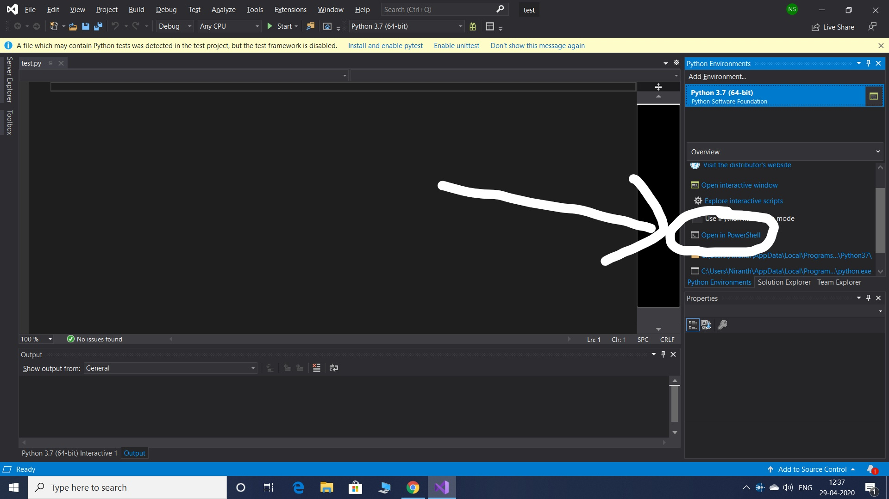

## Installation of PyBullet

The installation of PyBullet is as simple as:
(sudo)`pip install PyBullet` (Python 2.x), 
`pip3 install PyBullet`
This will expose the PyBullet module as well as pybullet_envs Gym environments.

If you are getting Visual C++ version issues in Windows, then

1. Uninstall any python platform such as anaconda, python IDLE, visual studio including visual studio basic tools and related softwares and restart the machine (Just to be on safer side, make a clean installation).
2. Install python IDLE v3.7.7 from [here](https://www.python.org/ftp/python/3.7.7/python-3.7.7-amd64.exe), you can go for the latest one too which is supported by your machine, but just because older versions are more compatible, here v3.7.7 is included. During installation check mark add to path option.
3. Install visual studio basic tools from [here](https://drive.google.com/file/d/1rhnHXYUMPnS9Z3ygkJMOJ40bkZiTSonF/view?usp=drivesdk). This is the web based setup. If you are able to successfully install visual studio basic tools then jump to step 6.
4. If you get an error while installing visual studio basic tools such as .Net framework 4.5 or above is required then install it from [here](https://www.microsoft.com/en-in/download/details.aspx?id=30653). This link is for framework 4.5 you can install the latest one too, which is supported by your machine. If you don't get any error in this them jump to Step 6.
5. While installation of .Net framework, if you get error such as package is not applicable to your computer, that's mostly because service pack update is missing, or if it says that a particular update package is needed, then kindly update your windows through windows update, or try searching for that particular update package on the web.
6. Open command prompt (cmd.exe), type command
   ```pip install wheel pybullet```
7. Open python IDLE this will open the shell, under file tab click new, in newly opened window you can type your code and run it.

#### If the above process doesn't work for windows users then try: 

1. Install Visual Studio 2019 Community version [here](https://visualstudio.microsoft.com/downloads/).
2. In the setup, in workloads select “Python Development” and “Desktop development with C++”.
3. After installation, launch Visual Studio and create a new python project.
4. Goto Tools>Python>Python Environments.
5. In the Overview bar on the right side, select “Open in Powershell”
<p align="center">
   
</p>

6. Once your Powershell pops up, type “pip3 install PyBullet” and press enter.
7. You can install any python package using pip in the Powershell.
8. Try running this example code:
```python
import pybullet as p
import time
import pybullet_data
physicsClient = p.connect(p.GUI)#or p.DIRECT for non-graphical version
p.setAdditionalSearchPath(pybullet_data.getDataPath()) #optionally
p.setGravity(0,0,-10)
planeId = p.loadURDF("plane.urdf")
cubeStartPos = [0,0,1]
cubeStartOrientation = p.getQuaternionFromEuler([0,0,0])
boxId = p.loadURDF("r2d2.urdf",cubeStartPos, cubeStartOrientation)
for i in range (10000):
    p.stepSimulation()
    time.sleep(1./240.)
cubePos, cubeOrn = p.getBasePositionAndOrientation(boxId)
print(cubePos,cubeOrn)
p.disconnect()
```
**Contact us if you face any difficulties with the installation.**
