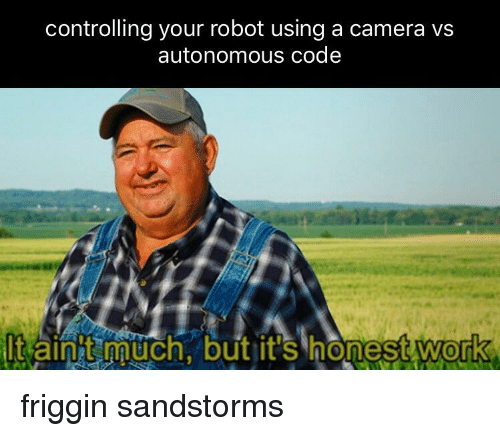

# Getting an image from camera

  

* An image from a camera in the simulator has lots of uses in Computer Vision-based controllers, Object detection, etc.
* There are **3 important functions** to get an image by placing camera anywhere in the simulator:
1. **computeViewMatrix**:

parameter type  | Name | type | Description
--- | --- | --- | ---
required  | cameraEyePosition | vec3, list of 3 floats | eye position in Cartesian world coordinates
required  | cameraTargetPosition | vec3, list of 3 floats | position of the target (focus) point, in Cartesian world coordinates
required  | cameraUpVector | vec3, list of 3 floats | up vector of the camera, in Cartesian world coordinates
optional  | physicsClientId | int | unused,added for API consistency

* cameraEyePosition is the position where the camera is to be placed.
* cameraTargetPosition is the focal point of the camera
* cameraUpVector is a 3D vector that points in the general direction of “up” from the camera.
* Output is the 4x4 view matrix, stored as a list of 16 floats.

2.**computeProjectionMatrixFOV**

parameter type  | Name | type | Description
--- | --- | --- | ---
required  | fov | float | field of view
required  | aspect | float | aspect ratio
required  | nearVal | float | near plane distance
required  | farVal | float | far plane distance
optional  | physicsClientId | int | unused,added for API consistency

* field of view:  the field of view is that part of the world that is visible through the camera at a particular position and orientation in space; objects outside the FOV when the picture is taken are not recorded in the photo.
* aspect ration: the ratio of the width to the height of an image or screen.
* near plane distance: The distance from the camera to the nearest object in the scene.
* far plane distance: The distance from the camera to the farthest object in the scene.

3. **getCameraImage**

* View Matrix and Projection matrix computed above are used in this function to set the parameters of the camera
* You can refer to this documentation for a description of this function:

 
 [getCameraImage](https://docs.google.com/document/d/10sXEhzFRSnvFcl3XxNGhnD4N2SedqwdAvK3dsihxVUA/preview#heading=h.u1jisfnt6984)
  

* Here is an example for your understanding of the above functions [camera_example.py](camera_example.py)
* Try to change different parameters in the above example and see how the image changes.
