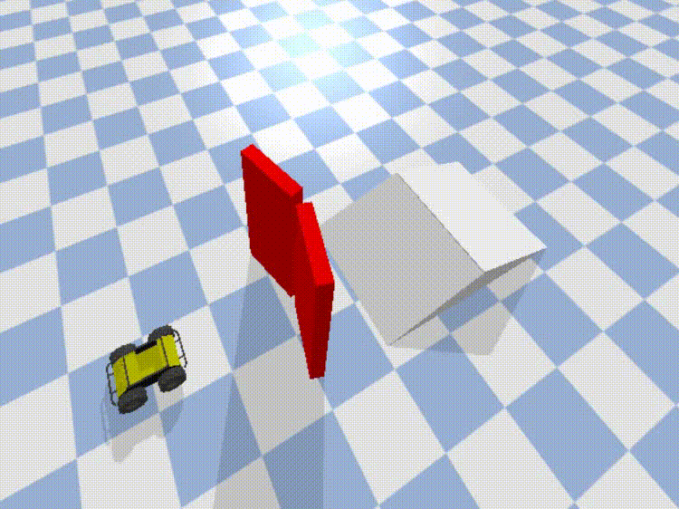

# Master Task!!!
After learning various functions of PyBullet, now it's time to test how much you have grasped!! So, here is a major task for you...

## Part 1: Loading the World
Create a door.urdf file, and load various doors in the pybullet world. Constrain these doors with the world, so that they can be rotated about their hinges when an external torque is applied on them. 5 Pairs of doors (10 doors in total) should be loaded as shown in the following figure...
 

  
   <i>Top View: These red lines are the doors, load the doors in the world roughly at the above mentioned positions</i>

Next, you have to load pairs of wedges in front of the doors. For that, [the URDF of the wedge](wedge.urdf) is given that makes use of [the ramp.stl](ramp.stl). Download both of these files in the same directory as your python file. The pair should be such that, both the wedges in it should be facing opposite to each other. Now load a husky at the following position...
 

  
  
  

Look for "globalScaling" attribute in the loadURDF function.

## Part 2: The Motion
Now, when you press 1 on the keyboard, first pair of doors should open, press 2 for second pair, 3, 4 and 5...
Now, the husky should pass through each pair of door one by one and then climb over the wedges, if any. To control the husky, you need to again press the arrow keys on keyboard. UP and DOWN arrows should move the husky forward and backward, RIGHT and LEFT arrow keys should turn it right and left. 
You can look at the [car.py](car.py) file for the starter code. Run this file and you will see the husky moving according to your controls. Implement the same thing for this task.

Here, I have demonstrated the passing of the husky through one pair of doors. You need to do it for all the doors.
 

  
  
  

  
Try to make the husky follow a path roughly similar to this 👇
 

  
  

  
Submit your python file, door.urdf and a video of the simulation on the following link:
- [Here!! Here!!](https://forms.gle/XhPvdYha7G98Ngr49)  
