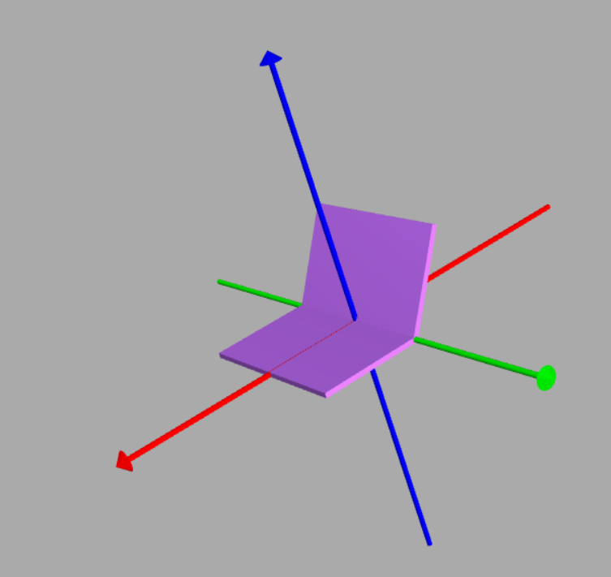

Before anything, let's learn how the skeleton of a robot looks like.
# Universal Robot Structure
So, a robot is basically any machine that, along with doing some computations, can move as well. And for that, in a robot, we have links - things that move - and joints - things that make the links move. A robot is made up of several links connected by movable joints. These joints have their respective motors that move these joints. Every robot has a base link, from which whole of the robot branches out. The base link is connected to a child link with some joint. That child link is connected to its own child link and acts as a parent link for its child link.
 

  

In the above example, Link 1 is the base link. Its child links are Link 2 and Link 3 that are connected to the base link using Joint 1 and Joint 2 respectively. Link 3 is further connected to Link 4 using Joint 3. Link 4 is the child link of Link 3. Link 3 is the parent link of Link 4.

**Note**: A link can have multiple child links, but only one parent link. A Base Link doesn't have any parent link.

Here, we don't consider the actual shape and design of the motors or joints, just their functioning is considered. Also, in order to control the joints, whatever electronic material is required, is also ignored here. We program a controller that directly controls the joints.

### Types of Robot Joints
- **Fixed Joints**: These joints do not allow any type of relative motion between the two links.  

- **Revolute Joints**: Allow rotation about a single axis.  

- **Continuous Joints**: Combination of Revolute Joints along all directions. 

- **Prismatic Joints**: These Joints allow translation along a single axis. 

- **Cylindrical Joints**: Combination of Revolute and Prismatic Joints. 

- **Planar Joints**: Translation in a plane. 

- **Floating Joints**: Allow translation and rotation in all directions.

# The URDF
URDF (Unified Robot Description Format) is an XML file that contains the description of various links and joints of the robot. Properties like geometry, color, mass etc. of the robot's links and friction coefficient, damping factors etc. of the joints can be specified in the URDF file. Tools like ROS or CAD can be used to generate these files, but we are not focused on that part. Here our aim is to understand the working and rendering of a URDF file.

### Let us learn how to create a URDF file.
First, you need to understand the basic XML syntax. For this, you can refer to the following video:
- [How to write XML files](https://www.youtube.com/watch?v=1JblVElt5K0)

To start with the URDF basics, you can refer to the following lecture:
- [Introduction to URDFs](https://ocw.tudelft.nl/course-lectures/2-2-1-introduction-to-urdf)

Now, it's time to fire up a text editor and write a URDF of your own. Go through the following tutorials to create a URDF of your own. Don't worry about the visualization. Just focus on writing the URDF:
- [Create your own URDF file](http://wiki.ros.org/urdf/Tutorials/Create%20your%20own%20urdf%20file)
- [Building Visual Robot Model](http://wiki.ros.org/urdf/Tutorials/Building%20a%20Visual%20Robot%20Model%20with%20URDF%20from%20Scratch)

The various tags and attributes might be confusing at the first sight such as the relative position and orientation of joints and links. To get an in-depth description of various tags and attributes, we recommend you to go through the following links once:
- [Links](http://wiki.ros.org/urdf/XML/link)
- [Joints](http://wiki.ros.org/urdf/XML/joint)

If you want to load and visualise your URDF, just click on the following link, paste your URDF file there and click on 'Load URDF'. Your robot will be rendered there.
- [URDF visualiser](https://mymodelrobot.appspot.com/5629499534213120)

**Note**: The visual tag is only for the visual properties of the links. If you want to enable collision properties for the visible portion, you need to add a collision tag and add same attributes and values as you added in the visual tag. Otherwise, your link will _seem_ to be at one place and will be having _collisions_ at some other unknown place :)

You might have some trouble debugging the URDF file. The tags and syntax might tempt you to scratch your head. Hopefully, linux users have a work around this problem. Open your terminal and type the following command:

    $ sudo apt-get install liburdfdom-tools

Now, you should be able to run a command named as 'check_urdf'. Pass the relative path of your urdf file as an attribute to the command:
  
    $ check_urdf <path to the URDF file>

This will parse the URDF file and will tell you exactly which line has error in it. If the file is parsed successfully, then a summary of the parent and child links will be outputted.

# Task for the part
### Task 1: 
You need to create a urdf similar to a laptop with an open lid, a revolute joint between the two sections. Just write the visual and collision tags.
 

  
  

  
### Task 2: Bonus Task
Create a URDF of a humanoid using simple shapes like sphere, cylinder etc. Don't worry about the motion of the bot. Just the visual should be human enough. You can start with the head of the bot as its base link. If you are unable to visualise one, then you can make a bot similar to the following:
 

  
  

  
Although you don't need to worry about the motion, but the joints should work as expected. You can slide the trackbars given on the top right corner of the URDF visualiser. Thus, you can move various joints manually to see if they are working.   Task 1 is mandatory. For both of the tasks, you need to create their URDFs, load it in the simulator mentioned above, make a short video of the simulation and upload it on the following link:
- [Task Submission](https://forms.gle/BcyPStBBSEmJAp7E8)

With this, you are good to go to the Part 2!
 

   
  <i>Let the physics haunt you forever</i>
  

